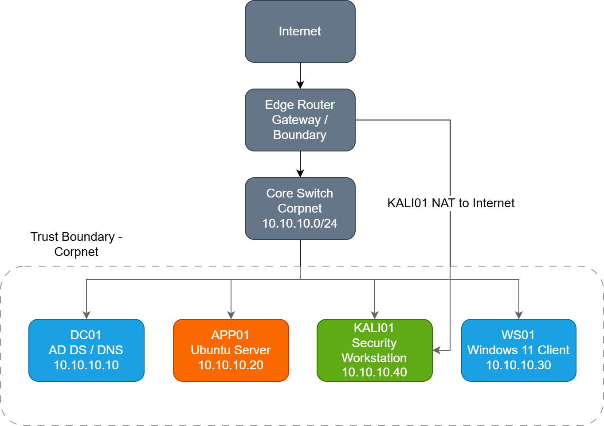

# Network Topology

## Overview

Apex Dynamics runs a single flat enterprise subnet, corpnet, addressed as
10.10.10.0/24. Every server and client sits on this one network. Internet access
is provided through an edge router at the boundary.

The network supports a roughly 150-person SaaS company with a mixed Windows and
Linux estate, centralised identity through Active Directory, and a dedicated
security testing capability. The topology is kept deliberately small and flat at
this stage — it covers what the enterprise actually needs without adding
structure the portfolio can't yet justify.

The full layout is shown in the network diagram:

## Addressing

The network uses the RFC1918 private range 10.10.10.0/24.

| Host   | Role                        | Address      |
|--------|-----------------------------|--------------|
| DC01   | Domain Controller / DNS     | 10.10.10.10  |
| APP01  | Ubuntu application server   | 10.10.10.20  |
| WS01   | Windows 11 client           | 10.10.10.30  |
| KALI01 | Security workstation        | 10.10.10.40  |

Infrastructure takes the low addresses. Anything added later goes above
10.10.10.100, so the servers stay in a predictable block.

10.10.10.0/24 was chosen over a range like 192.168.1.0/24 for a simple reason:
both are private, but 192.168.x.x is what home routers hand out by default.
10.10.10.0/24 is easy to remember, stays clear of that default range, and looks
closer to the addressing you'd actually see inside a company.

## Static addressing

The infrastructure hosts use static IPs rather than DHCP. This is not optional
for a domain — it's driven by how Active Directory and DNS depend on each other.

Active Directory relies on DNS to function. Domain controllers register their
services in DNS as SRV records, and clients find the domain by querying DNS for
those records before they can authenticate or pull Group Policy. If DC01's
address changed under a DHCP lease, its DNS records would point at the wrong
place, and clients could fail to locate the domain at all.

Static addressing removes that risk. The servers keep the same address every
time, DNS stays accurate, and troubleshooting is simpler because a host's
address is something you already know rather than something you have to look up.

## Segmentation and trust boundary

Every corp host sits inside one trust boundary on corpnet, with the edge router
separating that network from the internet.

There's only one subnet at this stage, and that's deliberate. A single-site
enterprise of this size runs fine on a flat network — splitting servers and
clients into separate VLANs wouldn't change how anything works today, it would
just add configuration for its own sake.

Network segmentation is worth doing, but it belongs later in the story. It's
recorded as a hardening candidate for Forge, where improving the environment
based on assessment findings is the whole point. Introducing it now would put
complexity ahead of need.

## KALI01 and internet access

KALI01 is the security engineering workstation. Unlike the other hosts, it has a
second path to the internet alongside its corpnet connection.

It needs that path to pull down tooling and updates while still being able to
reach the isolated enterprise network for testing. The other hosts don't get
internet access because they don't need it — they're internal enterprise systems.

The obvious question is why a workstation is allowed to bypass the boundary at
all. The answer is that KALI01 isn't a production Apex Dynamics asset. It's the
security engineer's own testing box, and its internet path is a lab convenience,
not part of the enterprise design. This is exactly the kind of thing that stays
out of the logical architecture and belongs in the implementation notes instead.

## Logical vs implementation

This document describes the logical enterprise network — what exists and why.
How the topology is recreated in the lab (VirtualBox, the NAT adapter, the
Internal Network) is documented separately under the setup docs. The logical
view describes intent; the implementation view describes deployment, and keeping
them apart stops one from muddying the other.